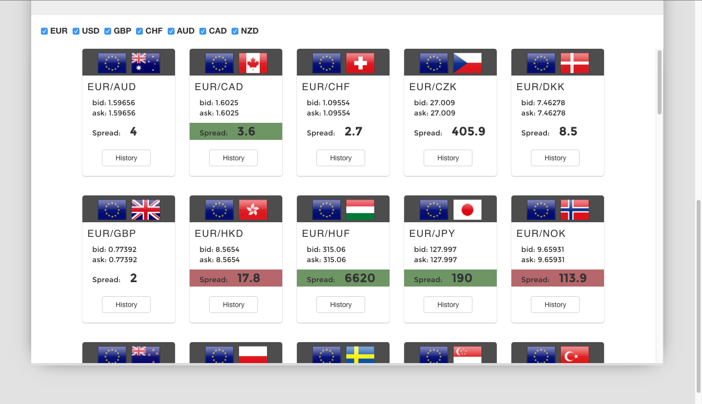
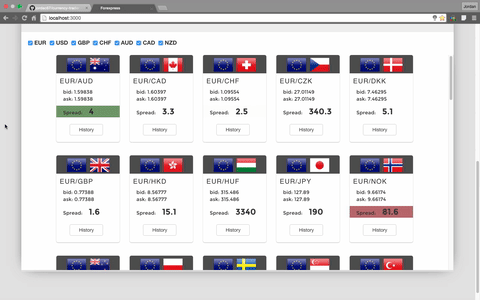

# ForEx-press
A website for foreign exchange traders to receive live spread and historical data regarding various currencies. 


##Built with the following technologies:
 - Javascript with EcmaScript 6
 - React.js
 - Node.js/Express
 - MongoDB/Mongoose
 - Jquery
 - Underscore
 - Gulp
 - Webpack
 - SASS/CSS3/Bootstrap/HTML5
 
###Summary:###
Forexpress was built to serve the purpose of providing real time price and spread updates as they change in the Foreign Exchange market. The application also allows currency traders to view candlestick charts for each pairing and filter based on their desired currencies. This website was built mainly with React.js for dynamic view updates, and Node.js/MongoDB for retrieving real time data through the Oanda API.

###Install:###
**1.** Go to the root directory and run `npm install --save`

**2.** Create a free trade account with Oanda to obtain a bearer token: http://www.oanda.com/

**3.** In the instrument.js file, insert your Oanda bearer token in the /prices post request. 
```
instruments.post('/prices', parseText, function(req, res) { 
  var bearer;
  var query = req.body
  var prices = 'https://api-fxpractice.oanda.com/v1/prices?instruments=' + query;
  request(prices, {
    'auth': {
      'bearer': bearer
      }
    }, function (error, response, body) {
    if (error) {
      console.log(error)
    } else if (!error && response.statusCode === 200) {
      res.send(response);            
    };
  });
});
```
**4.** Run the server using `node app.js`. If no data is updating, check Oanda's server status by using the GET server call below:
```
curl http://api-status.oanda.com/api/v1/services
```

**Currency Table:**


**Live Demo:**



**Historical Graph:**

