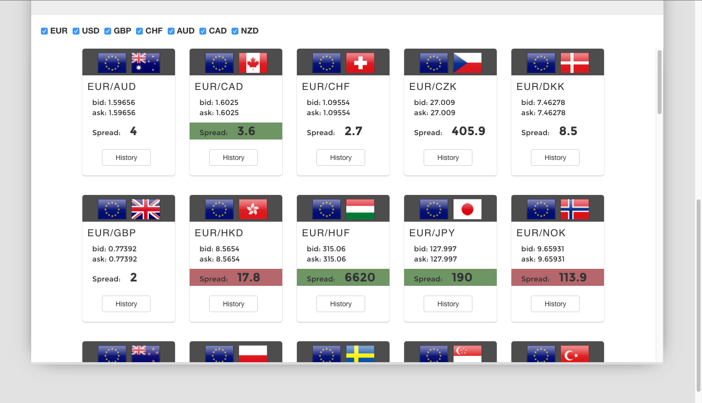
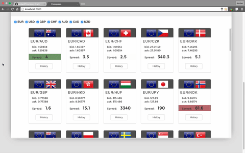
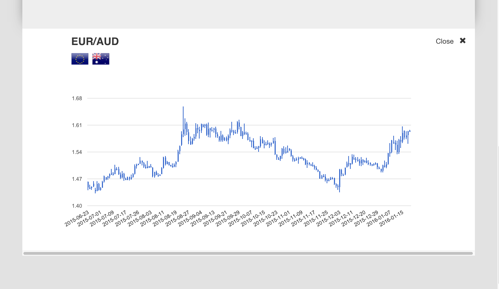

# currency-trader
A website for currency traders to receive live spread and historical data regarding various currencies. 

**Built with the follow technologies:**
 - React.js
 - Node.js
 - MongoDB
 - Jquery
 - Underscore
 - SASS
 
**Summary:**
Forexpress was built to serve the purpose of providing real time price and spread updates as they change in the currency market. The application also allows traders to view historical data for each pairing and filter based on their desired currencies. This website was built using React.js for dynamic view updates, and Node.js/MongoDB for retrieving real time data through the Oanda API.

**Currency Table:**

**Live Demo:**

**Historical Graph:**

